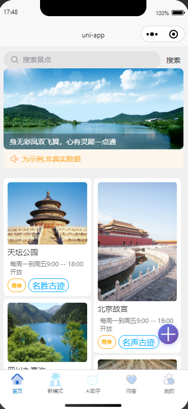
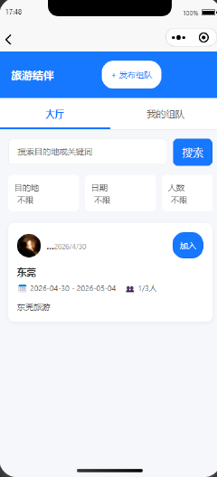
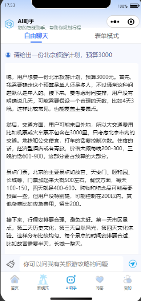
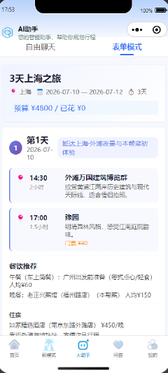
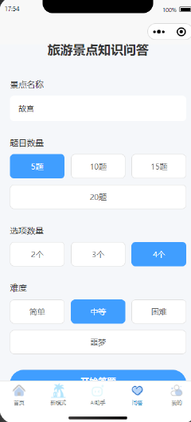
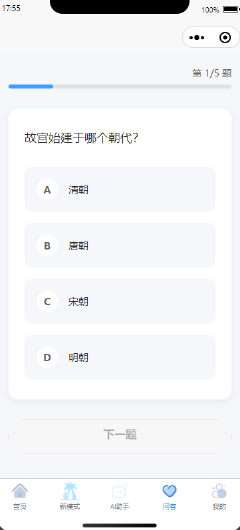
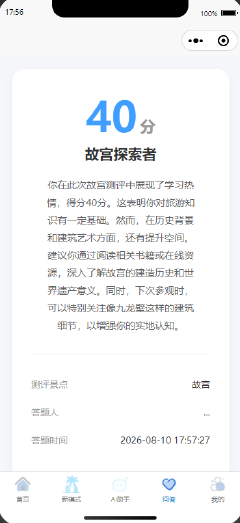
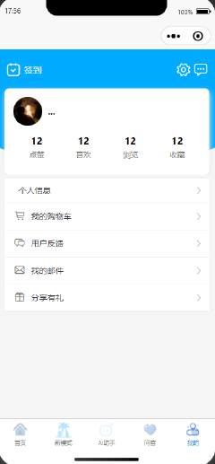

<div align="center">

# 🧠 BrainlessTravel — AI 智能旅游规划小程序

<p>
  
  
  
  
  
  
  
</p>

<p><b>基于 SpringBoot + UniApp + 讯飞星火大模型 的 AI 智能旅游规划微信小程序</b></p>
<p>前后端分离 · 单仓库管理 · 开箱即用 · 适合课程设计 / 毕设 / 开源学习</p>

</div>

---

## 📑 目录

- [项目简介](#-项目简介)
- [功能特性](#-功能特性)
- [界面预览](#-界面预览)
- [技术栈](#-技术栈)
- [项目结构](#-项目结构)
- [环境依赖](#-环境依赖)
- [快速开始](#-快速开始)
  - [1. 环境准备](#1-环境准备)
  - [2. 数据库初始化](#2-数据库初始化)
  - [3. MinIO 对象存储安装配置](#3-minio-对象存储安装配置)
  - [4. 后端启动](#4-后端启动)
  - [5. 前端启动](#5-前端启动)
- [数据库表结构](#-数据库表结构)
- [配置说明](#-配置说明)
- [接口文档](#-接口文档)
- [安全规范](#-安全规范)
- [常见问题](#-常见问题)
- [许可证](#-许可证)

---

## 🎯 项目简介

**BrainlessTravel** 是一款面向微信小程序的 AI 智能旅游规划应用。用户通过微信授权快速登录后，即可享受 AI 智能行程规划、景点知识问答、寻伴同游组队、景点浏览收藏等一站式旅游服务。

项目采用 **前后端分离** 架构，单仓库整合管理，后端提供完整的 RESTful API，前端基于 UniApp 跨平台开发，真正做到开箱即用。

> 💡 适合用作：课程设计、毕业设计、技术学习、二次开发基础框架

---

## ✨ 功能特性

### 🏠 首页探索
- 景点搜索与智能推荐
- 轮播图展示热门景点
- 景点卡片列表（含开放时间、分类标签）
- 瀑布流式布局，浏览体验流畅

### 🤖 AI 智能助手
- **自由聊天模式**：与讯飞星火大模型实时对话，咨询旅游攻略、预算规划、路线推荐
- **表单模式**：输入目的地、天数、预算，AI 自动生成结构化行程单（含每日时间安排、景点推荐、餐饮住宿、费用明细）

### 🤝 寻伴同游
- 发布旅游组队信息（目的地、日期、人数、描述）
- 大厅浏览所有组队卡片，支持关键词搜索与多维筛选
- 一键加入队伍，实时查看组队进度

### ❓ 旅游景点知识问答
- 基于 AI 自动生成个性化测试题目（景点名称、题目数量、选项数、难度自定义）
- 沉浸式答题体验，进度条实时反馈
- AI 智能评分与个性化评价报告，生成专属称号（如"故宫探索者"）

### 👤 个人中心
- 微信授权登录，JWT 安全认证
- 用户数据统计（点赞、喜欢、浏览、收藏）
- 每日签到、我的购物车、用户反馈、邮件通知、分享有礼
- 个人信息管理与设置

### 🛡️ 系统能力
- 基于 JWT 的登录校验与接口权限拦截
- Redis 缓存热门景点与用户信息，接口响应极速
- MyBatis-Plus 逻辑删除，数据安全不丢失
- MinIO 对象存储，支持 10MB 单文件 / 50MB 批量图片上传

---

## 📸 界面预览
<table>
  <tr>
    <td align="center"><b>🏠 首页</b></td>
    <td align="center"><b>🤝 寻伴同游</b></td>
  </tr>
  <tr>
    <td></td>
    <td></td>
  </tr>
  <tr>
    <td align="center"><b>🤖 AI 自由对话</b></td>
    <td align="center"><b>📋 AI 行程规划</b></td>
  </tr>
  <tr>
    <td></td>
    <td></td>
  </tr>
  <tr>
    <td align="center"><b>⚙️ 问答设置</b></td>
    <td align="center"><b>📝 AI 智能出题</b></td>
  </tr>
  <tr>
    <td></td>
    <td></td>
  </tr>
  <tr>
    <td align="center"><b>📊 AI 评价报告</b></td>
    <td align="center"><b>👤 个人中心</b></td>
  </tr>
  <tr>
    <td></td>
    <td></td>
  </tr>
</table>

### 底部导航栏

| 图标 | 页面 | 功能描述 |
|:----:|:----:|:---------|
| 🏠 | 首页 | 景点浏览、搜索、推荐 |
| 🌴 | 新模式 | 寻伴同游组队功能 |
| 🤖 | AI助手 | 自由聊天 / 表单模式行程规划 |
| 💬 | 问答 | AI 景点知识问答挑战 |
| 👤 | 我的 | 个人中心、数据统计、系统设置 |

---

## 🛠️ 技术栈

### 后端技术

| 技术 | 版本 | 说明 |
|------|------|------|
| Spring Boot | 3.2+ | 核心框架 |
| MyBatis-Plus | 3.5+ | ORM 框架（逻辑删除、自动填充、分页插件） |
| MySQL | 8.0+ | 关系型数据库 |
| Redis | 5.0+ | 缓存中间件（Lettuce 连接池） |
| MinIO | 最新 | 对象存储服务（景点图片上传存储） |
| 讯飞星火大模型 | V2/V3 | AI 智能旅游问答、行程生成、知识评测 |
| JWT | 0.12+ | 登录令牌认证 |
| Maven | 3.6+ | 项目构建工具 |

### 前端技术

| 技术 | 说明 |
|------|------|
| UniApp | 跨平台小程序开发框架 |
| Vue 3 | 前端响应式框架 |
| uni_modules | 官方组件生态 |
| 自定义封装 | 全局 API 请求拦截、统一错误处理、JWT 自动续期 |

---

## 📁 项目结构

```text
BrainlessTravel/
├── backend/                         # SpringBoot 后端源码
│   ├── src/main/java/
│   │   └── net/togogo/springboot_travel/
│   │       ├── config/              # 配置类（Redis、MinIO、WebMvc、拦截器）
│   │       ├── controller/          # 控制器层（用户、景点、AI、文件、问答、组队）
│   │       ├── service/             # 业务逻辑层
│   │       ├── mapper/              # 数据访问层（MyBatis-Plus）
│   │       ├── entity/              # 实体类
│   │       ├── dto/                 # 数据传输对象
│   │       ├── vo/                  # 视图对象
│   │       ├── utils/               # 工具类（JWT、MinIO、AI 调用封装）
│   │       └── SpringbootTravelApplication.java
│   ├── src/main/resources/
│   │   ├── application.yml          # 主配置文件（⚠️ 不上传 GitHub）
│   │   ├── application-template.yml # 配置模板（✅ 上传仓库）
│   │   └── sql/
│   │       └── travel_init.sql      # 数据库初始化脚本
│   └── pom.xml
├── uniapp-front/                    # UniApp 微信小程序前端源码
│   ├── pages/
│   │   ├── index/                   # 首页
│   │   ├── buddy/                   # 寻伴同游
│   │   ├── ai/                      # AI 助手（聊天 + 行程规划）
│   │   ├── quiz/                    # 知识问答（设置 + 答题 + 结果）
│   │   └── mine/                    # 个人中心
│   ├── components/                  # 公共组件
│   ├── static/                      # 静态资源
│   ├── utils/                       # 工具封装（request、config、auth）
│   └── manifest.json                # 小程序配置
├── docs/
│   └── screenshots/                 # 项目截图（README 引用）
├── .gitignore                       # Git 忽略配置
└── README.md                        # 项目说明文档
```

---

## 📋 环境依赖

在启动项目前，请确保本地已安装以下环境：

| 依赖 | 版本要求 | 下载/安装 |
|------|---------|----------|
| JDK | 17+ | [Oracle](https://www.oracle.com/java/technologies/downloads/) / [OpenJDK](https://adoptium.net/) |
| MySQL | 8.0+ | [官方下载](https://dev.mysql.com/downloads/) |
| Redis | 5.0+ | [官方下载](https://redis.io/download) |
| Maven | 3.6+ | [官方下载](https://maven.apache.org/download.cgi) |
| Node.js | 16+ | [官方下载](https://nodejs.org/) |
| Docker | 任意 | [官方下载](https://www.docker.com/)（用于运行 MinIO） |
| HBuilderX | 最新 | [官方下载](https://www.dcloud.io/hbuilderx.html) |
| 微信开发者工具 | 最新 | [官方下载](https://developers.weixin.qq.com/miniprogram/dev/devtools/download.html) |

---

## 🚀 快速开始

### 1. 环境准备

克隆仓库到本地：

```bash
git clone https://github.com/den603/BrainlessTravel.git
cd BrainlessTravel
```

---

### 2. 数据库初始化

#### 2.1 创建数据库

使用 MySQL 客户端（命令行、Navicat、DataGrip 均可）创建数据库：

```sql
CREATE DATABASE IF NOT EXISTS travel
  DEFAULT CHARACTER SET utf8mb4
  DEFAULT COLLATE utf8mb4_unicode_ci;
```

> 💡 `utf8mb4` 支持完整的 Unicode 字符（包括 emoji），`utf8mb4_unicode_ci` 排序规则对中文支持更好。

#### 2.2 导入数据表与初始数据

项目提供了完整的初始化脚本 `backend/src/main/resources/sql/travel_init.sql`，包含：
- ✅ 所有业务表的 `CREATE TABLE` 语句
- ✅ 逻辑删除字段 `is_delete` 与索引
- ✅ 景点示例数据（天坛、故宫、九寨沟等）
- ✅ 轮播图数据
- ✅ 题库数据（故宫、广州、上海等景点）
- ✅ 示例旅行计划数据

**命令行导入方式：**

```bash
mysql -u root -p travel < backend/src/main/resources/sql/travel_init.sql
```

**图形工具导入方式（Navicat / DataGrip）：**
1. 连接本地 MySQL，选中 `travel` 数据库
2. 右键 → 运行 SQL 文件 → 选择 `travel_init.sql`
3. 执行完成后刷新表列表，确认表已创建

#### 2.3 验证导入结果

导入成功后，应包含以下核心表（共 20 张）：

| 模块 | 表名 | 说明 |
|------|------|------|
| 系统 | `user` | 微信用户信息 |
| 首页 | `banner` | 首页轮播图 |
| 首页 | `scenic` | 景点信息 |
| 首页 | `scenic_play` | 景点游玩推荐 |
| AI 助手 | `chat_history` | AI 自由聊天历史 |
| AI 助手 | `t_travel_plan` | AI 生成的旅行计划 |
| 问答 | `question` | 景点题库 |
| 问答 | `question_fallback` | 题库兜底表 |
| 问答 | `user_answer_record` | 用户答题记录 |
| 问答 | `user_answer_detail` | 用户答题详情 |
| 组队 | `team` | 寻伴组队信息 |
| 组队 | `team_member` | 组队成员关系 |
| 导游 | `tb_private_guide` | 私人导游信息 |
| 导游 | `tb_guide_booking` | 导游预约表 |
| 导游 | `tb_guide_booking_traveler` | 预约出行人关联 |
| 导游 | `tb_traveler` | 出行人信息 |

验证命令：
```sql
USE travel;
SHOW TABLES;
```

> ⚠️ **注意**：SQL 中的示例图片 URL 使用公网占位图，本地开发时如需显示真实图片，请替换为 MinIO 中上传的图片地址。

---

### 3. MinIO 对象存储安装配置

本项目使用 MinIO 存储景点图片、用户头像等文件。以下是完整的本地安装配置流程。除了下面讲述的方法Minio也可在本地下载使用，只需在网上把下载好的 `minio.exe` 放入 任意盘符`D:\MinIO\bin`下在切换到当前文件存储目录运行.\minio.exe server D:\MinIO\data即可。

#### 3.1 Docker 安装 MinIO（推荐）

确保本地已安装 Docker，然后执行：

```bash
docker run -d   -p 9000:9000   -p 9001:9001   --name minio   --restart=always   -e "MINIO_ROOT_USER=minioadmin"   -e "MINIO_ROOT_PASSWORD=minioadmin"   -v ~/minio/data:/data   -v ~/minio/config:/root/.minio   quay.io/minio/minio server /data --console-address ":9001"
```

**参数说明：**

| 参数 | 说明 |
|------|------|
| `-p 9000:9000` | **API 端口**：后端程序通过此端口上传/下载文件 |
| `-p 9001:9001` | **控制台端口**：浏览器访问 Web 管理界面 |
| `MINIO_ROOT_USER` | 管理员账号（对应 `application.yml` 中的 `access-key`） |
| `MINIO_ROOT_PASSWORD` | 管理员密码（对应 `application.yml` 中的 `secret-key`） |
| `-v ~/minio/data:/data` | 数据持久化到本地目录，容器删除后数据不丢失 |

#### 3.2 验证 MinIO 启动状态

```bash
# 查看容器是否运行
docker ps | grep minio

# 应输出类似：
# CONTAINER ID   IMAGE           STATUS         PORTS
# xxxxxxxx       minio/minio     Up 2 minutes   0.0.0.0:9000-9001->9000-9001/tcp
```

#### 3.3 登录 MinIO 控制台创建存储桶

1. 浏览器访问：`http://localhost:9001`
2. 使用账号 `minioadmin` / 密码 `minioadmin` 登录
3. 点击左侧菜单 **Buckets** → **Create Bucket**
4. 输入桶名：`travel` → 点击 **Create Bucket**

> 💡 桶名必须与 `application.yml` 中 `minio.bucket-name` 的值一致。

#### 3.4 配置桶的访问权限（重要！）

创建桶后，需要设置访问策略，否则前端无法直接访问图片：

1. 进入 `travel` 桶 → 点击 **Access Rules**
2. 点击 **Add Access Rule**
3. 配置如下：
   - **Prefix**：`*`（通配符，匹配所有对象）
   - **Access**：`Read Only`（只读，允许公开访问图片）
4. 点击 **Save**

或者设置为 **Anonymous** 访问：
- 进入桶 → **Access Policy** → 选择 `Public`

> ⚠️ **安全提示**：本地开发可设为 Public；生产环境建议使用 Presigned URL 或配置更精细的访问策略。

#### 3.5 上传示例图片（可选）

如果想让首页景点显示真实图片：

1. 在控制台进入 `travel` 桶
2. 点击 **Upload** → 选择本地景点图片
3. 上传后文件路径为：`travel/xxx.jpg`
4. 访问地址：`http://localhost:9000/travel/xxx.jpg`
5. 将 `scenic` 表中的 `img` 字段更新为上述地址

#### 3.6 application.yml 配置对应

确保你的 `application.yml` 中 MinIO 配置与上述安装一致：

```yaml
minio:
  endpoint: http://localhost:9000    # API 端口（不是 9001）
  access-key: minioadmin
  secret-key: minioadmin
  bucket-name: travel
```

> 📌 `endpoint` 使用 **9000 端口**（API 端口），9001 是控制台端口，后端代码不要配错。

---

### 4. 后端启动

#### 4.1 配置核心文件 ⚠️

进入 `backend/src/main/resources/`，将 `application-template.yml` 复制一份，重命名为 **`application.yml`**：

```bash
cp backend/src/main/resources/application-template.yml    backend/src/main/resources/application.yml
```

修改以下私密配置：

- [ ] MySQL 数据库账号密码
- [ ] Redis 密码（本地无密码可留空）
- [ ] MinIO 服务端点、AccessKey、SecretKey、存储桶名
- [ ] 微信小程序 AppID、AppSecret
- [ ] 讯飞星火大模型 AppID、ApiKey、ApiSecret
- [ ] JWT 自定义加密密钥（生产环境务必更换）

#### 4.2 启动项目

1. 使用 IDE（IntelliJ IDEA）导入 `backend` 目录
2. Maven 自动加载依赖，或执行：

```bash
cd backend
mvn clean install
```

3. 运行 `SpringbootTravelApplication.java` 启动类

```
后端默认端口：8080
接口根路径：/api
完整接口地址：http://localhost:8080/api/
```

启动成功后，控制台应输出：

```
Tomcat started on port 8080 (http) with context path '/api'
景区后端服务启动成功！
```

---

### 5. 前端启动

#### 5.1 导入项目

1. 打开 **HBuilderX**
2. 选择 `文件 → 导入 → 从本地目录导入`，选择 `uniapp-front/` 目录

#### 5.2 安装依赖

```bash
cd uniapp-front
npm install
```

#### 5.3 配置后端接口地址

修改 `uniapp-front/utils/config.js`，将 `baseUrl` 改为本地后端地址：

```javascript
const config = {
  baseUrl: 'http://localhost:8080/api',     // 本地开发环境
  // baseUrl: 'https://your-domain.com/api', // 生产环境
};

export default config;
```

#### 5.4 编译运行

1. 点击 HBuilderX 菜单栏 `运行 → 运行到小程序模拟器 → 微信开发者工具`
2. 首次运行需配置微信开发者工具路径（`设置 → 运行配置`）
3. 微信开发者工具自动打开，即可预览小程序

> 📌 **注意**：微信登录功能需要在微信开发者工具中配置合法域名，本地开发可勾选「详情 → 本地设置 → 不校验合法域名」进行测试。

---

## 🗄️ 数据库表结构

以下是项目核心表的结构说明，帮助理解业务数据模型。

### 核心表关系图

```
┌─────────────┐     ┌─────────────┐     ┌─────────────┐
│    user     │────→│chat_history │     │ t_travel_plan│
│  (用户表)   │     │(AI聊天历史) │     │ (旅行计划)  │
└─────────────┘     └─────────────┘     └─────────────┘
       │
       │ 1:N
       ▼
┌─────────────┐     ┌─────────────┐     ┌─────────────┐
│user_answer_ │────→│  question   │     │   banner    │
│  record     │     │  (题库表)   │     │ (轮播图表)  │
│(答题记录)   │     └─────────────┘     └─────────────┘
└─────────────┘
       │
       │ 1:N
       ▼
┌─────────────┐
│user_answer_ │
│   detail    │
│(答题详情)   │
└─────────────┘

┌─────────────┐     ┌─────────────┐
│    team     │────→│ team_member │
│  (组队表)   │     │(组队成员表) │
└─────────────┘     └─────────────┘

┌─────────────┐     ┌─────────────┐     ┌─────────────┐
│   scenic    │────→│ scenic_play │     │ tb_private_ │
│  (景点表)   │     │(游玩推荐表) │     │   guide     │
└─────────────┘     └─────────────┘     └─────────────┘
```

### 关键字段设计说明

| 表名 | 关键字段 | 设计意图 |
|------|---------|---------|
| `user` | `openid` | 微信唯一标识，建立 UK 索引防止重复注册 |
| `scenic` | `tag` (JSON) | 灵活存储景点标签数组，如 `["著名", "名胜古迹"]` |
| `scenic` | `address` (JSON) | 存储经纬度数组 `["经度", "纬度"]` |
| `question` | `options` (JSON) | 存储选项数组，支持动态选项数量 |
| `t_travel_plan` | `plan_content` (JSON) | 存储 AI 生成的完整结构化行程 |
| `t_travel_plan` | `preferences` (JSON) | 用户兴趣标签，如 `["美食", "自然风光"]` |
| 所有业务表 | `is_delete` | MyBatis-Plus 逻辑删除字段，0=未删除，1=已删除 |

---

## ⚙️ 配置说明

以下是 `application.yml` 中各配置项的详细说明：

### 服务端配置

```yaml
server:
  port: 8080                      # 后端服务端口
  servlet:
    context-path: /api            # 全局接口前缀，所有接口前需加 /api
```

### 数据库配置

```yaml
spring:
  datasource:
    driver-class-name: com.mysql.cj.jdbc.Driver
    url: jdbc:mysql://localhost:3306/travel?useUnicode=true&characterEncoding=utf8&useSSL=false&serverTimezone=Asia/Shanghai&allowPublicKeyRetrieval=true
    username: root                # 修改为你的 MySQL 用户名
    password: xxxxxxxx            # 修改为你的 MySQL 密码
```

### Redis 配置

```yaml
spring:
  data:
    redis:
      host: 127.0.0.1
      port: 6379
      password:                   # 本地无密码留空，生产环境务必设置
      database: 0
      timeout: 3000ms
      lettuce:
        pool:
          max-active: 8
          max-idle: 8
          min-idle: 0
          max-wait: -1ms
```

### 文件上传配置

```yaml
spring:
  servlet:
    multipart:
      max-file-size: 10MB         # 单个文件最大 10MB
      max-request-size: 50MB      # 一次请求总文件大小 50MB
      enabled: true
```

### MyBatis-Plus 配置

```yaml
mybatis-plus:
  type-aliases-package: net.togogo.springboot_travel.entity
  global-config:
    db-config:
      logic-delete-field: is_delete    # 逻辑删除字段
      logic-not-delete-value: 0        # 未删除标记
      logic-delete-value: 1            # 已删除标记
  configuration:
    map-underscore-to-camel-case: true # 数据库下划线转驼峰命名
```

### MinIO 对象存储配置

```yaml
minio:
  endpoint: http://localhost:9000      # MinIO API 地址（9000端口）
  access-key: minioadmin               # MinIO AccessKey
  secret-key: minioadmin               # MinIO SecretKey
  bucket-name: travel                  # 存储桶名称（需提前创建）
```

> 📌 详细安装步骤见上方 [MinIO 对象存储安装配置](#3-minio-对象存储安装配置)。

### 微信小程序配置

```yaml
wechat:
  mini:
    appid: xxxxxxxxxxxxxxxxxxxx        # 替换为你的小程序 AppID
    appsecret: xxxxxxxxxxxxxxxxxxxx    # 替换为你的小程序 AppSecret
    login-url: https://api.weixin.qq.com/sns/jscode2session
```

> 📌 获取方式：登录 [微信公众平台](https://mp.weixin.qq.com/) → 开发 → 开发管理 → 开发设置

### JWT 令牌配置

```yaml
jwt:
  secret: YourCustomSecretKeyHere2026  # 自定义密钥（生产环境务必更换为复杂随机字符串）
  expire: 86400000                     # Token 有效期：1 天（单位：毫秒）
```

### 讯飞星火大模型配置

```yaml
spark:
  app-id: xxxxxxxx                     # 讯飞开放平台获取
  api-key: xxxxxxxxxxxxxxxxxxxxxxxx    # 讯飞开放平台获取
  api-secret: xxxxxxxxxxxxxxxxxxxxxx   # 讯飞开放平台获取
  url: https://spark-api-open.xf-yun.com/x2/chat/completions
```

> 📌 获取方式：登录 [讯飞开放平台](https://xinghuo.xfyun.cn/) → 控制台 → 创建应用 → 获取服务接口认证信息

---

## 📡 接口文档

项目启动后，可通过以下方式查看和测试接口：

### 常用接口前缀

| 接口类别 | 路径前缀 | 说明 |
|---------|---------|------|
| 用户模块 | `/api/login/**` | 微信登录、用户信息、签到统计 |
| 景点模块 | `/api/scenic/**` | 景点列表、详情、收藏、搜索 |
| AI 助手 | `/api/chat/**` | 自由对话、行程规划生成 |
| 问答模块 | `/api/qa/**` | AI 出题、答题提交、评价报告 |
| 组队模块 | `/api/team/**` | 发布组队、加入队伍、我的组队 |
| 文件上传 | `/api/file/**` | 图片上传、MinIO 预签名 URL |

> 所有接口（除登录相关外）需在请求头中携带 `Authorization: Bearer <token>`

---

## 🔒 安全规范

本项目已配置完整的 `.gitignore`，**真实密钥配置文件不会上传至 GitHub**，确保仓库安全干净。

### 已屏蔽内容

- ✅ 数据库密码、Redis 密钥
- ✅ 微信小程序 AppID / AppSecret
- ✅ 讯飞星火 AI 密钥
- ✅ MinIO 访问凭证
- ✅ JWT 加密密钥
- ✅ 编译产物（`target/`、`dist/`、`unpackage/`）
- ✅ 前端依赖包（`node_modules/`）
- ✅ IDE 缓存文件（`.idea/`、`.vscode/`）

### GitHub 开源规范

1. **永远不要**将 `application.yml` 提交到仓库，仓库中仅保留 `application-template.yml` 模板
2. 定期更换生产环境的 JWT 密钥和 API 密钥
3. 生产环境建议使用环境变量或配置中心（Nacos、Apollo）注入敏感配置

---

## ❓ 常见问题

### Q1: 导入 SQL 报错 "Unknown character set" 或 "utf8mb4_0900_ai_ci"？

**原因**：MySQL 版本低于 8.0，不支持 `utf8mb4_0900_ai_ci` 排序规则。

**解决**：升级 MySQL 到 8.0+，或手动将 SQL 文件中所有 `utf8mb4_0900_ai_ci` 替换为 `utf8mb4_general_ci`。

---

### Q2: 导入 SQL 后景点图片显示不出来？

**原因**：SQL 中的示例图片使用公网占位图，或你使用的是本地 MinIO 内网地址。

**解决**：
1. 启动 MinIO 并创建 `travel` 桶
2. 上传自己的景点图片到 MinIO
3. 更新 `scenic` 表的 `img` 字段为 `http://localhost:9000/travel/xxx.jpg`

---

### Q3: MinIO 连接失败，上传图片报错？

**排查步骤：**
1. 检查本地 MinIO 服务是否已启动：`docker ps | grep minio`
2. 确认端口 9000（API 端口）和 9001（控制台端口）是否开放
3. 核对 `application.yml` 中的 `endpoint`、`access-key`、`secret-key` 是否正确
4. 确认 `travel` 存储桶已创建，且权限为 `public` 或已配置正确的访问策略
5. 检查 `application.yml` 中 `minio.endpoint` 是否写的是 **9000 端口**（不是 9001）
6. 检查本地开发可设为 Public
7. 检查微信小程序是否勾选不校验合法域名
---

### Q4: 微信登录报错 "appid missing" 或 "code 无效"？

**排查步骤：**
1. 检查 `application.yml` 中 `wechat.mini.appid` 和 `appsecret` 是否配置正确
2. 确认小程序 AppID 与当前运行的微信开发者工具绑定一致
3. 检查前端 `wx.login()` 获取的 `code` 是否及时传给后端（code 有效期约 5 分钟）
4. 本地开发时，在微信开发者工具中勾选「详情 → 本地设置 → 不校验合法域名」

---

### Q5: AI 问答无响应或返回错误？

**排查步骤：**
1. 核对讯飞星火开放平台中的 `app-id`、`api-key`、`api-secret` 是否过期
2. 确认讯飞账户已开通「星火大模型 API」权限
3. 检查网络是否能访问 `https://spark-api-open.xf-yun.com`
4. 查看后端日志，确认请求参数和返回错误码

---

### Q6: 后端启动成功，但前端请求接口报 404？

**排查步骤：**
1. 确认后端日志中 `context path` 为 `/api`，而非空字符串
2. 检查 `application.yml` 缩进是否正确，`server.servlet.context-path` 必须与 `spring` 同级
3. 确认前端请求的 `baseUrl` 包含 `/api` 前缀，如 `http://localhost:8080/api`
4. 清除浏览器/微信开发者工具缓存，重新编译前端

---

### Q7: Redis 连接报错 "Connection refused"？

**排查步骤：**
1. 确认本地 Redis 服务已启动：`redis-cli ping` 应返回 `PONG`
2. 检查 `application.yml` 中 Redis 的 `host` 和 `port` 配置
3. 如果 Redis 设置了密码，确保 `password` 字段已填写
4. Windows 用户建议使用 WSL 或 Docker 运行 Redis

---

## 📜 许可证

本项目基于 [MIT License](LICENSE) 开源协议发布，您可以自由使用、修改和分发。

> ⚠️ **声明**：本项目仅供学习和技术交流使用，不得用于商业用途。项目中涉及的第三方 API（微信、讯飞星火等）请遵守各自平台的使用协议。

---

## 🙏 致谢

- [Spring Boot](https://spring.io/projects/spring-boot)
- [MyBatis-Plus](https://baomidou.com/)
- [UniApp](https://uniapp.dcloud.net.cn/)
- [讯飞星火大模型](https://xinghuo.xfyun.cn/)
- [MinIO](https://min.io/)

---

<div align="center">

**⭐ 如果这个项目对你有帮助，请点个 Star 支持一下！**

**欢迎提交 Issue 和 PR，一起完善这个项目！**

</div>
